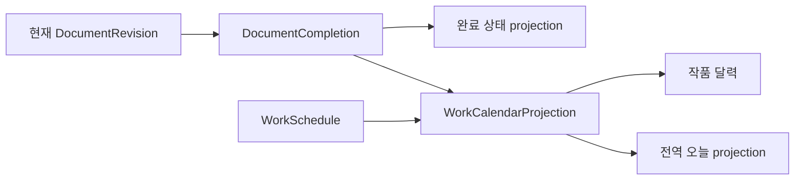

# 회차 완료 현재 상태 원장과 달력 합성 모델

- 상태: 승인됨
- 결정일: 2026-08-21
- 적용 제품: 이음 스튜디오
- 구현 대상: `D:\eum.studio`
- 승인 설계 원문: `C:\Users\limoj\.codex\attachments\bdf6eed9-84bc-461a-9cc4-1c5dbc1b42b1\pasted-text.txt`
- 승인 설계 원문 SHA-256: `2510A1A1FA3A7C02885DE39F65ED453CFD2869FFD867711F058FF0867D519E8E`

## 1. 결정

회차 완료는 `Document` 필드나 `WorkScheduleItem` 종류가 아니라 작품·문서 소유의 별도 현재 상태 원장 `DocumentCompletion`으로 저장한다.

- 완료는 사용자 명시 명령으로만 바뀐다.
- 글자 수, 마감일, 일정 완료로 회차 완료를 자동 추정하지 않는다.
- 완료 명령은 현재 원고를 durable 저장한 뒤 그 `DocumentRevision`을 기록한다.
- 원고 수정은 완료를 자동 취소하지 않는다.
- 완료 당시 revision과 현재 revision이 다르면 `edited-after-completion`으로 파생한다.
- 완료 취소는 행을 지우지 않고 revision을 증가시키며 완료 필드를 모두 비운다.
- 다시 완료하면 새 절대 시각, 로컬 날짜, 시간대, 현재 revision으로 갱신한다.
- 달력은 일정 원장과 완료 원장을 application 계층에서 합성하며 별도 달력 원본을 저장하지 않는다.



## 2. 정규 현재 상태

```ts
type DocumentCompletionProjection = {
  schemaVersion: 1;
  workId: EntityId<"Work">;
  documentId: EntityId<"Document">;
  revision: number;
  completedAt: string | null;
  completedDate: string | null;
  completedTimeZone: string | null;
  completedDocumentRevisionId: EntityId<"DocumentRevision"> | null;
  state: "incomplete" | "current" | "edited-after-completion";
  updatedAt: string | null;
};
```

완료 필드 네 개는 모두 null이거나 모두 값이 있어야 한다. 완료 기능을 한 번도 사용하지 않은 문서는 행을 미리 만들지 않고 다음 projection으로 읽는다.

```text
revision = 0
completedAt = null
completedDate = null
completedTimeZone = null
completedDocumentRevisionId = null
state = incomplete
updatedAt = null
```

`state`는 저장하지 않는다.

```text
완료 시각 또는 완료 revision 없음  -> incomplete
완료 revision = 현재 revision       -> current
완료 revision != 현재 revision      -> edited-after-completion
```

## 3. 상태 전이

| 현재 상태 | 요청 | 결과 |
| --- | --- | --- |
| 미완료 | 완료 | 현재 clock·시간대·revision으로 revision 1 생성 |
| 완료·최신 | 완료 | 멱등 반환, 시각과 revision 불변 |
| 완료 후 수정됨 | 완료 | 현재 clock·시간대·revision으로 재완료 |
| 완료 | 완료 취소 | 완료 필드 네 개를 비우고 revision 증가 |
| 미완료 | 완료 취소 | 멱등 반환, 행이 없으면 생성하지 않음 |
| 완료 원장 revision 불일치 | 어느 요청이든 | 충돌, 원장 불변 |
| 최신 원고 revision 불일치 | 완료 | 충돌, 원장 불변 |
| 다른 작품 문서 | 어느 요청이든 | 거부 |
| 보관·삭제된 문서 | 완료 | 거부 |

완료 취소 뒤 재완료는 새 완료 사실이다.

```text
최초 완료  revision 1
완료 취소  revision 2
다시 완료  revision 3
```

## 4. 명령과 저장 순서

renderer는 완료 시각·날짜·시간대를 보내지 않는다.

```ts
type SetDocumentCompletionCommand = {
  schemaVersion: 1;
  workId: EntityId<"Work">;
  documentId: EntityId<"Document">;
  expectedCompletionRevision: number;
  expectedDocumentRevisionId: EntityId<"DocumentRevision">;
  completed: boolean;
};
```

활성 회차 완료 순서는 다음으로 고정한다.

```text
완료 동작 잠금
-> 편집기 입력 잠금
-> IME 조합 확정 대기
-> durable save queue flush
-> 최신 DocumentRevision 확인
-> DocumentCompletion 명령
-> WorkspaceCatalog 재조회
-> WorkCalendar projection 갱신
-> 입력 잠금 해제
```

원고 flush가 실패하면 완료 원장을 쓰지 않는다. flush 뒤 완료 원장 commit 전까지 새 입력이 생기지 않도록 활성 편집기를 잠근다. 완료 원장 service는 transaction 안에서 문서 소유권, 활성 상태, 현재 manuscript revision을 다시 확인한다.

## 5. 날짜와 시간대

완료 명령을 실행하는 desktop/application 경계는 하나의 clock instant에서 세 값을 함께 만든다.

```ts
{
  completedAt: clock.now().toISOString(),
  completedDate: dateKey(clock.now(), timeZone),
  completedTimeZone: timeZone,
}
```

`completedDate`는 완료 당시 사용자의 달력 날짜라는 사실이다. 이후 앱의 현재 시간대가 바뀌어도 `completedAt`을 새 시간대로 다시 환산해 날짜를 바꾸지 않는다. 달력 범위 필터는 저장된 `completedDate`를 사용한다.

## 6. 카탈로그와 달력 projection

`WorkspaceDocumentSummary.completion`은 별도 완료 원장을 조회해 합성한다. 카탈로그가 완료 정보의 정규 원본이 되지는 않는다.

달력은 다음 union을 application 계층에서 만든다.

```ts
type WorkCalendarOccurrence =
  | WorkScheduleOccurrence
  | DocumentCompletionOccurrence;
```

완료 occurrence의 결정적 ID는 `document-completion:${documentId}`다. 완료 취소 시 사라지고, 재완료 시 같은 occurrence가 새 `completedDate`로 이동한다. `WorkScheduleItem`이나 가짜 `itemId`를 생성하지 않는다.

## 7. D-DAY 호환

기존 `episodeCount`와 `episodeNumber`는 글자 수 기반 추정 방식으로 그대로 보존한다. 기존 항목을 자동 변환하지 않는다.

명시 완료 원장을 사용하는 신규 모드만 추가한다.

```ts
type ExplicitCompletionWorkload =
  | {
      mode: "additionalCompletedDocuments";
      targetCount: number;
      baselineCompletedCount: number;
    }
  | {
      mode: "totalCompletedDocuments";
      targetCount: number;
    };
```

완료 취소는 신규 모드 진척을 감소시키고, 기존 글자 수 모드 결과에는 영향을 주지 않는다.

## 8. migration과 보존

- 기존 문서에서 완료 상태를 추정하거나 backfill하지 않는다.
- schema migration 뒤 기존 문서는 행 없음·미완료 projection이다.
- 완료 상태 테이블은 SQLite DB snapshot에 포함되어 기존 backup·restore 경계를 그대로 따른다.
- 문서를 보관해도 완료 행은 복구를 위해 보존하고 일반 카탈로그·달력 projection에서 제외한다.
- 첫 배포에는 append-only 완료 이력과 과거 날짜 보정, 일괄 완료를 넣지 않는다.

## 9. 구현 Gate

1. DC-0 — 이 ADR과 계약 확정. DB 변경 없음.
2. DC-1 — schema 13→14 migration, 완료 원장 영속화, 재시작·backup/restore.
3. DC-2 — parser·service·typed bridge와 카탈로그 completion 요약.
4. DC-3 — 활성 원고 durable flush·입력 잠금·최신 revision 완료 명령.
5. DC-4 — 회차 트리와 공통 헤더 완료 UI·완료 당시 버전 이동.
6. DC-5 — 일정과 완료의 `WorkCalendarProjection` 합성.
7. DC-6 — 기존 달력 UI를 합성 projection으로 전환.
8. DC-7 — 신규 명시 완료 D-DAY 진척 모드와 기존 모드 호환.
9. DC-8 — 모든 작품의 오늘 일정·오늘 완료를 전역 projection으로 합성.

각 Gate는 정적·단위·통합 검증과 필요한 production Electron 성공 경로를 통과한 뒤 다음 Gate로 진행한다.

## 10. 범위 밖

- `Document.completedAt` 필드 추가
- 회차 완료용 `WorkScheduleItem` 생성
- 글자 수 기반 자동 완료 또는 기존 데이터 backfill
- 완료 후 원고 수정 시 자동 완료 취소
- renderer가 완료 시각·날짜·시간대를 결정하는 동작
- 완료 취소 이력을 보여주는 append-only 이벤트 원장
- 기존 D-DAY 모드 자동 변환
- 여러 회차 일괄 완료와 과거 완료일 추정
