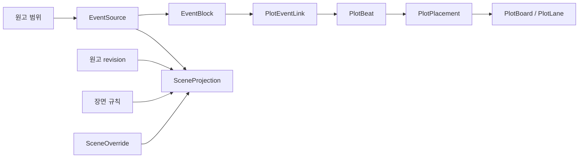

# 사건·플롯·장면 정규 모델

- 상태: 승인됨
- 결정일: 2026-08-16
- 적용 제품: 이음 스튜디오
- 구현 대상: `D:\eum.studio`
- 읽기 전용 레거시 근거: `D:\eum.editor`
- 승인 설계 원문 SHA-256: `2BA6C1687A2F34615654A86D8B3D9A6AD1F2F7762D3A5365CEFCE52C0C7B8925`

## 1. 결정

사건·플롯·장면을 하나의 타입이나 하나의 순서 필드로 합치지 않는다.

- `EventBlock`과 `PlotBeat`는 서로 독립된 정규 원본이다.
- 사건이 원고에서 실현된 범위는 `EventSource` 관계로 저장한다.
- 사건과 플롯의 의미적 관계는 `PlotEventLink`로 저장한다.
- 플롯 내용과 보드상의 위치는 분리하고, 위치는 `PlotPlacement`로 저장한다.
- 장면은 원고 revision, 장면 규칙, `SceneOverride`, 필요한 경우의 `SceneEventOverride`에서 계산한 `SceneProjection`이다.



이 결정은 다음 동작을 동시에 허용한다.

- 원고에 이미 있는 사건을 플롯 카드로 만든다.
- 아직 원고에 쓰지 않은 플롯을 원고 미연결 사건으로 만든다.
- 하나의 플롯에 여러 사건을 연결하고, 하나의 사건을 여러 플롯에 연결한다.
- 플롯 순서를 바꾸어도 원고 문장과 anchor는 움직이지 않는다.
- 원고 수정으로 사건의 범위 무결성이 바뀌어도 플롯 관계와 순서는 유지한다.
- 장면을 나누거나 합쳐도 사건·플롯 원본을 복제하지 않는다.

## 2. 현재 구현과 이 결정의 관계

현재 구현에서 확인한 경계는 다음과 같다.

- `src/application/structure/event-block-contract.ts`의 사건 생성은 특정 문서의 비어 있지 않은 정확한 선택 범위와 인용문을 요구한다. 원고 미연결 예정 사건을 만들 수 없다.
- `src/domain/poc-3-storage-ledger.ts`와 `src/platform/storage/node-sqlite-ledger.ts`의 `EventBlock`/`event_blocks`는 `rangeGroupId`/`range_group_id`를 필수로 가진다.
- `src/application/plots/plot-contract.ts`의 플롯은 제목·단계·요약·메모 원본이지만 보드, 배치, 플롯 순서, 사건 관계가 없다.
- `src/application/plots/plot-source-contract.ts`의 `PlotThreadSource`는 정확한 원고 근거 관계다. 사건과 플롯의 의미적 관계가 아니다.
- `src/application/structure/scene-override-contract.ts`와 `src/application/structure/work-structure-overview.ts`는 장면 override와 경계 목록까지만 제공한다. override가 적용된 최종 장면 목록은 아직 없다.

이번 결정은 기존 승인 설계 전체를 교체하지 않는다. 다음 두 지점만 현재 사용자의 승인 설계로 구체화한다.

1. 기존 `EventBlock.rangeGroupId` 필수 소유를 제거하고 `EventSource` 관계로 분리한다.
2. 기존 사건의 `orderKey` 의미를 `outlineOrderKey`로 명시하고 플롯 순서에 재사용하지 않는다.

기존 승인 설계 원문과 `docs/design-baseline.md`의 checksum은 수정하지 않는다. 물리 DB 이름 변경이 필요한 경우에도 이 결정과 별도의 명시적 migration으로 수행한다.

## 3. 고정 불변식

다음은 이후 모든 Gate에서 직접 보존하고 검증해야 하는 불변식이다.

1. 원고 순서와 플롯 순서는 독립이다.
2. 플롯 배치 이동은 원고 본문, document revision, anchor, range group, `EventSource`, `EventBlock.outlineOrderKey`를 수정하지 않는다.
3. 사건의 플롯화와 플롯의 사건화는 타입 변환이 아니라 상대편 원본 생성과 `PlotEventLink` 추가다.
4. `EventBlock`은 활성 `EventSource`가 하나도 없는 상태로 존재할 수 있다. 가짜 1글자 범위를 만들지 않는다.
5. 장면은 기본적으로 저장 원본이 아니라 파생 `SceneProjection`이다.
6. 사건 제목과 플롯 제목은 생성 순간에만 복사할 수 있으며 이후 자동 양방향 동기화하지 않는다.
7. `PlotThreadSource`와 `PlotEventLink`는 전혀 다른 관계이며 서로 대체하지 않는다.
8. renderer는 SQLite, 파일, OAuth token에 직접 접근하지 않는다.
9. 연결 또는 배치를 해제해도 상대 원본을 자동으로 치우지 않는다.
10. 사용자 선택 범위는 임의로 확장하거나 추정하지 않는다.

`movePlotPlacement` 전후에는 최소한 다음이 직접 같음을 증명해야 한다.

```text
documentRevisionId
anchor record
rangeGroup
EventSource
EventBlock.outlineOrderKey
PlotBeat 내용
```

일반적인 같은 lane 내 한 번의 이동에서 바뀌는 정렬 의미 값은 대상 `PlotPlacement.orderKey`뿐이다. 저장 원장의 revision·시각 같은 변경 메타데이터를 제외하면 원고·사건·플롯 내용과 다른 순서 값은 바뀌지 않는다.

## 4. 정규 엔티티와 책임

| 엔티티 | 정규 책임 |
| --- | --- |
| `EventBlock` | 이야기 속 사건 자체와 사건 개요 계층·순서 |
| `EventSource` | 사건이 실제 원고의 어느 정확한 범위에서 실현됐는지 |
| `PlotBeat` | 작가가 플롯에서 계획하고 편집하는 카드 내용 |
| `PlotThreadSource` | 플롯을 생각하게 된 정확한 원문 근거 |
| `PlotEventLink` | 플롯 카드와 사건의 의미적 관계 |
| `PlotBoard` | 플롯 카드를 배치하는 작품 소유 작업 공간 |
| `PlotLane` | 보드 안의 행 |
| `PlotPlacement` | 특정 플롯 카드가 특정 보드·lane에서 차지하는 위치 |
| `SceneProjection` | 현재 원고와 장면 규칙·override에서 계산한 최종 장면 |
| `SceneEventOverride` | 범위 중첩으로 계산한 사건 소속이 틀릴 때만 쓰는 예외 |

### 4.1 명칭 호환

현재 `plot_threads` 원장은 첫 관계·배치 migration에서 물리 이름을 바꾸지 않는다. application contract와 projection에서 플롯 카드의 역할을 `PlotBeat`로 드러내는 호환 계층을 둔다. DB 테이블 이름 변경은 별도 승인과 migration 없이는 수행하지 않는다.

현재 사건 원장의 물리 `order_key`는 migration 동안 유지할 수 있지만 application/domain 의미는 `outlineOrderKey`다. 이 값은 원고 순서나 플롯 순서로 읽지 않는다.

## 5. EventBlock과 EventSource

목표 계약은 다음 의미를 가진다.

```ts
type EventBlock = {
  eventBlockId: string;
  workId: string;
  title: string;
  note: string;
  parentEventId: string | null;
  outlineOrderKey: string;
  revision: number;
  retiredAt: string | null;
};

type EventSource = {
  eventSourceId: string;
  workId: string;
  eventBlockId: string;
  rangeGroupId: string;
  role: "primary" | "supporting";
  revision: number;
  retiredAt: string | null;
};
```

사건 상태는 별도 상태 플래그를 정규 원본으로 저장하지 않고 활성 source와 anchor 무결성에서 계산한다.

| 계산 상태 | 근거 |
| --- | --- |
| 원고 미연결 | 활성 `EventSource` 없음 |
| 실현됨 | 활성 source의 anchor가 정상 해석됨 |
| 검토 필요 | anchor 재해석 필요 |
| 연결 손상 | anchor 손상 |

### 5.1 기존 사건 migration

Gate 2의 schema migration은 한 트랜잭션에서 다음을 수행한다.

1. `event_sources` 원장을 추가한다.
2. 모든 기존 활성·보존 사건의 현재 `range_group_id`를 읽어 같은 작품 소유의 `primary EventSource`를 하나씩 backfill한다.
3. 사건 수, 생성된 source 수, 작품 소유권, 참조 range group의 존재를 검증한다.
4. `event_blocks`에서 원고 범위 직접 소유를 제거하는 새 schema로 전환한다.
5. schema version을 올리고 migration receipt를 기록한다.

schema version 상승 뒤에는 `event_blocks.range_group_id`를 읽는 암묵적 fallback을 두지 않는다. 변환할 수 없는 레코드가 있으면 migration 전체를 commit하지 않고 원본을 보존한다.

새 예정 사건은 활성 source가 없는 정상 `EventBlock`이다. 이후 사용자가 정확한 원고 범위를 선택해 명시적으로 연결할 때만 anchor, range group, `EventSource`를 만든다.

## 6. PlotEventLink와 변환 명령

```ts
type PlotEventLink = {
  plotEventLinkId: string;
  workId: string;
  plotBeatId: string;
  eventBlockId: string;
  role: "primary" | "supporting";
  createdFrom: "event-to-plot" | "plot-to-event" | "manual-link";
  revision: number;
  retiredAt: string | null;
};
```

- 활성 `(workId, plotBeatId, eventBlockId)` 쌍은 유일하다.
- 플롯 하나에 여러 사건, 사건 하나에 여러 플롯을 허용한다.
- MVP에서 한 플롯 카드의 활성 `primary` 사건은 최대 하나이고 나머지는 `supporting`이다.
- idempotent 기본 명령은 이미 활성 관계가 있으면 중복 원본·링크를 만들지 않고 authoritative projection을 반환한다.

### 6.1 사건에서 플롯 만들기

한 application transaction에서 다음을 수행한다.

1. 같은 사건을 `primary`로 연결한 활성 플롯이 있는지 확인한다.
2. 없으면 `PlotBeat`를 만든다.
3. `PlotEventLink`를 만든다.
4. 기본 보드·lane에 `PlotPlacement`를 만든다.
5. authoritative board projection을 반환한다.

기본 동작은 이미 연결된 플롯을 여는 것이다. 별도 명시적 액션만 새 플롯 카드를 만들 수 있다. 사건 제목과 메모는 새 플롯 생성 순간에만 플롯 제목과 요약 초안으로 복사한다.

### 6.2 플롯에서 사건 만들기

- 정확한 원고 선택이 있으면 `EventBlock`, exact anchor와 range group, `EventSource`, `PlotEventLink`를 한 transaction에서 만든다.
- 원고 선택이 없으면 source 없는 `EventBlock`과 `PlotEventLink`만 만들고 `원고 미연결` 상태를 projection에서 표시한다.
- 현재 커서 주변의 임의 한 글자를 사건 범위로 만들지 않는다.

생성 이후 사건 제목과 플롯 제목은 독립 편집한다. 제목이 다르면 projection에서 불일치를 표시할 수 있고, 한쪽 제목을 가져오는 명시적 명령만 허용한다.

## 7. PlotBoard, PlotLane, PlotPlacement

플롯 내용과 배치 위치를 분리한다.

```ts
type PlotBoard = {
  plotBoardId: string;
  workId: string;
  title: string;
  mode: "sequence" | "time-map";
  revision: number;
};

type PlotLane = {
  plotLaneId: string;
  workId: string;
  plotBoardId: string;
  title: string;
  kind: "default" | "main" | "subplot" | "stage" | "custom";
  orderKey: string;
  revision: number;
};

type PlotPlacement = {
  plotPlacementId: string;
  workId: string;
  plotBoardId: string;
  plotLaneId: string;
  plotBeatId: string;
  orderKey: string;
  storyTime: number | null;
  storyTimeEnd: number | null;
  revision: number;
  retiredAt: string | null;
};
```

MVP는 작품별 기본 sequence 보드 하나와 기본 lane 하나를 필요 시 생성한다. 작품·보드·lane ID와 표시명은 runtime에서 발급하거나 사용자 입력·지역화 계층에서 제공하며 제품 코드의 고정 작품 데이터로 두지 않는다. 같은 플롯을 같은 보드에 한 번만 배치할지 여부는 Gate 4에서 명시적으로 결정하며 이 ADR이 임의의 unique 제약을 추가하지 않는다.

배치를 retire해도 `PlotBeat`는 남고, 같은 플롯을 다른 보드에 배치할 수 있다. 배치 revision과 플롯 내용 revision은 독립이다.

## 8. 서로 독립인 네 순서

| 순서 | 계산·저장 근거 | 변경 경로 |
| --- | --- | --- |
| 원고 순서 | 문서 순서 + anchor offset | 원고와 anchor projection에서만 계산 |
| 사건 개요 순서 | `EventBlock.outlineOrderKey` | 사건 트리 이동 명령만 변경 |
| 플롯 순서 | `PlotPlacement.orderKey` | 상대 위치 이동 명령만 변경 |
| 이야기 시간 | `PlotPlacement.storyTime`/`storyTimeEnd` | 시간 지도 명령만 변경 |

플롯 보드에서 B를 A 앞으로 옮겨도 원고에서 A가 먼저 쓰였다면 원고 순서는 A, B로 유지할 수 있어야 한다. `EventBlock.outlineOrderKey`를 플롯 순서로 재사용하지 않는다.

## 9. 상대 위치 이동 계약

renderer는 새 배열 index나 화면 좌표를 저장 명령으로 보내지 않는다.

```ts
type MovePlotPlacementCommand = {
  schemaVersion: 1;
  workId: string;
  plotPlacementId: string;
  targetBoardId: string;
  targetLaneId: string;
  beforePlacementId?: string;
  afterPlacementId?: string;
  expectedPlacementRevision: number;
  expectedBoardRevision: number;
};
```

application 계층은 한 transaction 안에서 다음을 수행한다.

1. 대상과 이웃이 같은 작품에 속하는지 확인한다.
2. 앞·뒤 이웃이 실제 target board/lane에 있고 서로 인접한 유효한 위치인지 확인한다.
3. 대상 placement와 board revision 충돌을 확인한다.
4. `createOrderKeyBetween(previousKey, nextKey)` 순수 domain 함수로 fractional order key를 계산한다.
5. placement를 저장한다.
6. authoritative board projection을 반환한다.

일반적인 이동은 대상 placement 한 행만 갱신한다. key가 지나치게 길어져 비교·저장 한계를 넘기기 직전에만 lane 전체를 한 transaction에서 재균형한다. 이동할 때마다 모든 카드를 정수로 재번호화하지 않는다.

마우스 UI는 Gate 5에서 다음 계약을 따른다.

- 6px 이상 이동한 뒤 drag를 시작한다.
- drag 중에는 renderer 로컬 preview와 삽입선만 갱신하고 DB를 쓰지 않는다.
- 카드 위쪽 절반은 앞, 아래쪽 절반은 뒤, 목록 끝은 마지막 위치다.
- pointer up에서 `MovePlotPlacementCommand`를 정확히 한 번 실행한다.
- auto-scroll, `Escape`, `pointercancel`, revision conflict rollback을 지원한다.
- 저장 중 두 번째 drag를 시작하지 않는다.
- 먼저 접근 가능한 `앞으로 이동`·`뒤로 이동`과 `Alt+↑`·`Alt+↓` 경로를 구현하고 같은 command를 사용한다.

## 10. 사건레일 projection

사건레일은 모드를 명시적으로 분리한다.

### 원고 순서

- 작품의 문서 순서와 anchor 위치에서 전역 원고 좌표를 파생한다.
- drag로 순서를 바꾸지 않는다.
- 사건 선택 시 정확한 원문과 범위로 이동한다.
- anchor 무결성을 표시한다.
- 정확한 텍스트 선택에서 사건을 만든다.
- 사건의 플롯화 액션을 제공한다.

### 플롯 순서

- `PlotPlacement.orderKey`를 사용하고 플롯 이동을 허용한다.
- 원고 미연결 예정 사건을 표시한다.
- 원고 위치와 플롯 위치 차이를 표시한다.
- 미플롯 사건을 보드에 놓으면 필요한 `PlotBeat`, `PlotEventLink`, `PlotPlacement`를 한 transaction에서 만든다.
- 이미 배치된 카드를 옮길 때는 `PlotPlacement`만 바꾼다.

## 11. SceneProjection

`SceneOverride(add | ignore | merge | split)` 원장은 유지한다. 사용자가 보는 기본 결과는 override 작업 목록이 아니라 적용이 끝난 장면 projection이다.

```ts
type SceneProjection = {
  sceneKey: string;
  workId: string;
  documentId: string;
  startAnchorId: string;
  endAnchorId: string | null;
  range: { start: number; end: number } | null;
  integrity: "resolved" | "needsReview" | "broken";
  source: "rule" | "override";
  events: readonly SceneEventProjection[];
};
```

계산 순서는 고정한다.

```text
현재 document revision
→ 장면 구분 규칙으로 기본 경계 계산
→ SceneOverride를 순서대로 fold
→ SceneProjection 생성
→ EventSource와 장면 범위 중첩 계산
→ 장면별 사건 projection 생성
→ SceneEventOverride 예외 적용
```

사건에 `sceneId`를 정규 저장하지 않는다. 원고 미연결 사건은 미배정으로 남거나 사용자가 명시적으로 특정 장면에 포함할 수 있다.

```ts
type SceneEventOverride = {
  sceneEventOverrideId: string;
  workId: string;
  sceneKey: string;
  eventBlockId: string;
  operation: "include" | "exclude";
  revision: number;
  retiredAt: string | null;
};
```

초기 `sceneKey`는 `documentId + startBoundaryAnchorId + endBoundaryAnchorId`에서 안정적으로 파생한다. 장면에 장기 고유 메타데이터를 붙이는 요구가 생기기 전에는 `SceneIdentity`나 장면 본문 사본을 만들지 않는다.

## 12. application과 저장 경계

계약은 다음 책임으로 분리한다.

```text
src/application/structure/
  event-source-contract.ts
  event-rail-projection.ts
  scene-projection.ts
  scene-event-override-contract.ts

src/application/plots/
  plot-beat-contract.ts
  plot-event-link-contract.ts
  plot-board-contract.ts
  plot-placement-contract.ts
  plot-board-projection.ts
```

필요한 명령·조회 표면은 다음과 같다.

```text
structure.createAnchorlessEvent
structure.linkEventSource
structure.replaceEventSource
structure.retireEventSource
structure.listEventRail
structure.listSceneProjection

plots.createPlotFromEvent
plots.createEventFromPlot
plots.linkEvent
plots.unlinkEvent
plots.createBoard
plots.createLane
plots.placeBeat
plots.movePlacement
plots.removePlacement
plots.listBoardProjection
```

호출 경로는 항상 다음 경계를 지난다.

```text
Renderer
→ typed StudioBridge
→ Desktop local workspace runtime
→ application command/query
→ SQLite ledger transaction
→ authoritative projection
```

renderer가 여러 독립 query를 임의로 조합하지 않도록 보드 조회는 board, lane, placement, plot, linked events, source integrity, scene keys, unplaced plots, unplotted events를 한 projection으로 반환한다.

## 13. 저장 제약

각 신규 원장은 작품 소유 FK와 revision, 생성·수정 시각, soft retirement를 가진다. 최소 제약은 다음과 같다.

- `event_sources`: event와 range group의 작품 소유권이 모두 `work_id`와 일치한다.
- `plot_event_links`: 활성 `(work_id, plot_beat_id, event_block_id)` 쌍은 유일하다.
- `plot_lanes`: lane과 board의 작품 소유권이 일치한다.
- `plot_placements`: board, lane, plot의 작품 소유권이 일치하고 활성 lane order 조회 index를 가진다.
- `storyTime`은 값이 있을 때 `0..100`, `storyTimeEnd`는 값이 있을 때 `storyTime..100`이다.
- 픽셀 좌표를 정규 저장하지 않는다.

구체 SQL, index 이름, 물리 컬럼 호환은 각 schema Gate에서 현재 migration 원장과 함께 확정한다. fixture의 작품명·ID·보드명·시간값을 제품 기본값이나 제한으로 사용하지 않는다.

## 14. 치우기와 연결 해제

다음은 서로 다른 명령이다.

| 사용자 행동 | 정규 처리 |
| --- | --- |
| 보드에서 제거 | `PlotPlacement` retire |
| 사건과 플롯 연결 해제 | `PlotEventLink` retire |
| 플롯 치우기 | `PlotBeat` retire, 사건 유지 |
| 사건 치우기 | `EventBlock` retire, 플롯 유지 |
| 원고 근거 해제 | `EventSource` retire |
| 둘 다 치우기 | 별도 명시적 복합 명령 |

한 원본을 치웠다는 이유로 연결된 상대 원본을 cascade retire하지 않는다. 남은 쪽은 치워진 연결 상대를 projection에서 표시하고 복구 또는 새 연결을 기다린다.

## 15. 구현 Gate

한 Gate를 구현하고 그 Gate의 실제 증거를 확인한 뒤 다음 Gate로 진행한다.

1. **ADR과 불변식 확정** — 이 문서와 실행 계획을 고정한다.
2. **사건 source 분리** — `EventSource`, 기존 사건 backfill, 원고 미연결 사건, source 연결·교체·해제, 기존 사건 생성 회귀.
3. **사건↔플롯 관계** — `PlotEventLink`, 양방향 생성, 수동 연결·해제, idempotency, 제목 불일치 projection.
4. **기본 플롯 보드와 순서** — 작품별 기본 board/lane, `PlotPlacement`, fractional key, 앞·뒤 이동, 재시작 보존.
5. **마우스 drag** — 로컬 preview, 삽입선, auto-scroll, 취소, drop당 한 command, 충돌 rollback, 키보드 이동.
6. **사건레일** — 작품 전역 원고 좌표, 정확한 원문 이동, 사건 생성·플롯화, 원고/플롯 순서 모드.
7. **완성된 장면 projection** — 기본 파서, override fold, 장면 범위, 사건 범위 중첩, 수동 예외, 최종 장면 UI.
8. **시간 지도** — 앞뒤 이동 완료 뒤에만 `storyTime 0..100`, 자유 drag, 겹침 stack, 정규화 값 저장을 구현한다.

첫 실제 구현 묶음의 순서는 다음과 같다.

```text
EventSource 분리와 원고 미연결 사건
→ PlotEventLink
→ 작품별 기본 보드 하나
→ PlotPlacement와 상대 위치 이동 command
→ 사건→플롯 / 플롯→사건
→ 앞·뒤 이동
→ 재시작 보존 E2E
→ 마우스 drag
```

## 16. 필수 수용 시나리오

### 사건→플롯→이동

```text
원고의 정확한 범위 선택
→ 사건 생성
→ 사건 플롯화
→ 다른 사건 앞으로 이동
→ 앱 정상 종료
→ 재실행
→ 플롯 순서 유지
→ 사건 선택 시 원래 원고 범위로 이동
```

### 플롯→예정 사건→원고 연결

```text
플롯 카드 생성
→ 사건화
→ 원고 미연결 사건 생성
→ 나중에 정확한 원고 범위 선택
→ 사건 근거 연결
→ 기존 플롯 링크 유지
```

### 원고 수정

```text
사건이 연결된 원고를 크게 수정
→ anchor가 needsReview 또는 broken
→ 플롯 카드와 플롯 순서 유지
→ 원고 연결 상태만 변경
```

### 연결 해제

```text
사건과 플롯 연결 해제
→ 사건 유지
→ 플롯 유지
→ 배치 유지
→ 재연결 가능
```

### 장면 변경

```text
장면 둘을 merge
→ SceneProjection 재계산
→ EventSource 유지
→ 사건의 장면 소속만 새 projection에 맞게 변경
→ 플롯 위치 유지
```

## 17. Gate 1 범위 밖

이 ADR Gate에서는 schema, application contract, runtime, preload, renderer, 패키징 결과를 변경하지 않는다. `D:\eum.editor`의 파일·DB·브라우저 저장소도 변경하지 않는다. 다음 Gate는 `EventSource` 분리와 원고 미연결 사건만 구현하며, `PlotEventLink`, 보드, drag, 사건레일, 장면 projection은 해당 Gate 전까지 앞당겨 구현하지 않는다.
